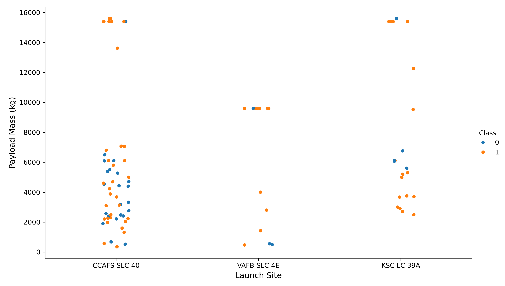
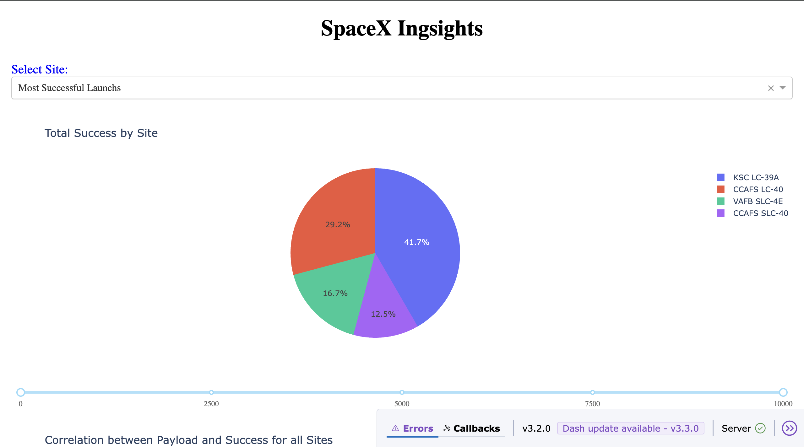
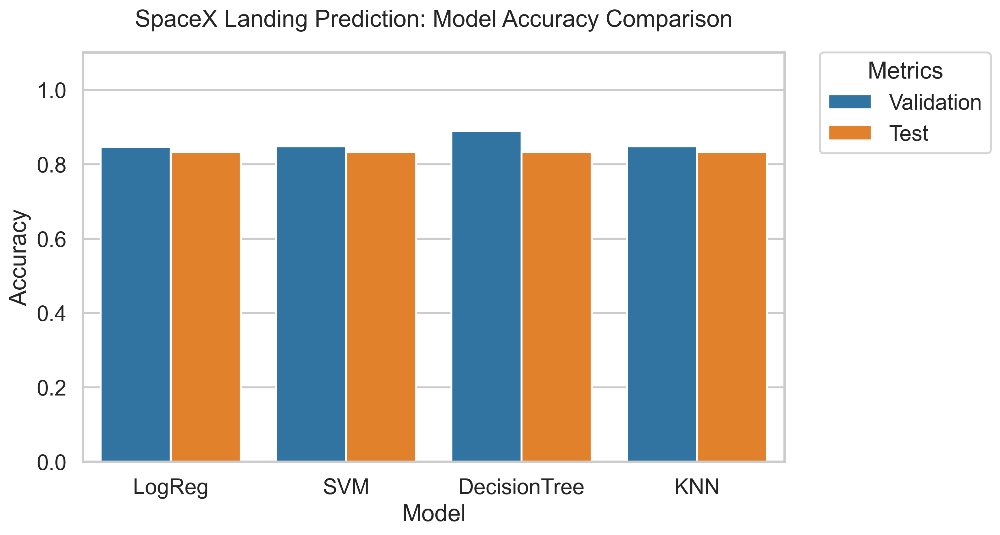
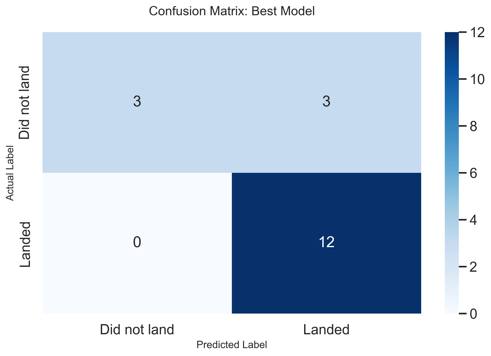

# SpaceX Falcon 9 İniş Tahmini Projesi 🚀

Bu proje, SpaceX'in Falcon 9 fırlatmalarındaki ilk aşama iniş başarısını tahmin etmek amacıyla uçtan uca bir veri bilimi iş akışını kapsamaktadır. Fırlatma sahaları ve yük ağırlığı gibi faktörleri analiz ederek, fırlatma maliyetlerini ve risklerini doğrudan etkileyen iniş başarısını öngörmeyi hedefler.

## 📁 Proje Yapısı

| Dosya / Klasör | Açıklama |
| :--- | :--- |
| `notebooks/` | Veri toplama, EDA (Keşifçi Veri Analizi) ve Makine Öğrenmesi süreçlerini içeren Jupyter Notebooklar. |
| `images/` | Analizlerde ve README dosyasında kullanılan görsel çıktılar ve grafikler. |
| `scripts/` | İnteraktif Plotly Dash web uygulaması için Python kodları. |
| `requirements.txt` | Projeyi çalıştırmak için gerekli Python kütüphanelerinin listesi. |

---

## 🛠️ Kullanılan Teknolojiler

* **Diller:** Python 3.x
* **Veri Analizi:** Pandas, NumPy
* **Görselleştirme:** Matplotlib, Seaborn, Folium, Plotly Dash
* **Veritabanı:** SQL / PostgreSQL
* **Makine Öğrenmesi:** Scikit-Learn (Lojistik Regresyon, SVM, Karar Ağacı, KNN)

---

## 🚀 Proje İş Akışı

### 1. Veri Toplama ve Hazırlama
* Veriler, SpaceX API'si ve web kazıma (web scraping) teknikleri kullanılarak toplandı.
* Veri temizleme işlemleri yapıldı ve SQL sorguları kullanılarak temel çıkarımlar elde edildi.

### 2. Keşifçi Veri Analizi (EDA)
Başarı oranları; farklı fırlatma sahaları, yük ağırlıkları ve yörünge türlerine göre analiz edildi.
> 

### 3. İnteraktif Görselleştirmeler
* **Folium**, fırlatma sahası konumlarını ve kıyı şeritlerine/ana yollara olan yakınlıklarını haritalandırmak için kullanıldı.
> 
> 

* **Plotly Dash**, gerçek zamanlı başarı analizi için interaktif bir panel oluşturmak amacıyla kullanıldı.
> 

### 4. Makine Öğrenmesi (ML)
Özellikler `StandardScaler` kullanılarak standartlaştırıldı ve en iyi model hiperparametrelerini bulmak için `GridSearchCV` uygulandı.

* **Model Karşılaştırması:** En iyi uyumu bulmak için çeşitli algoritmalar değerlendirildi.
> 

* **En İyi Model:** Karar Ağacı (Decision Tree)
* **Test Seti Doğruluğu:** %83.3

> 

---

## 🏁 Sonuçlar ve Çıkarımlar

Proje boyunca aşağıdaki temel bulgular tespit edilmiştir:

* **Fırlatma Sahası Dinamikleri:** KSC LC-39A sahası en yüksek başarı oranını göstermektedir. VAFB SLC-4E, kutupsal yörünge görevleri için kritik bir saha olmaya devam etmektedir.
* **Yük Ağırlığı Korelasyonu:** Başarı, en istikrarlı şekilde 2000kg ile 5000kg yük aralığında görülmektedir. 8000kg üzerindeki daha ağır yüklerde iniş riskinin arttığı gözlemlenmiştir.
* **Yörünge Başarısı:** Alçak Dünya Yörüngesi (LEO) görevleri en yüksek iniş başarısı oranına sahipken, GTO görevleri daha büyük bir zorluk teşkil etmektedir.
* **Model Performansı:** Test edilen tüm algoritmalar arasında **Karar Ağacı (Decision Tree)** modeli, %83.3 test doğruluğu ile en kararlı performansı sağlamıştır.
* **Maliyet Verimliliği:** İniş başarısının doğru tahmin edilmesi, SpaceX'in fırlatma maliyetlerini yaklaşık %70 oranında azaltabilecek roket yeniden kullanılabilirliği hedefini desteklemektedir.
